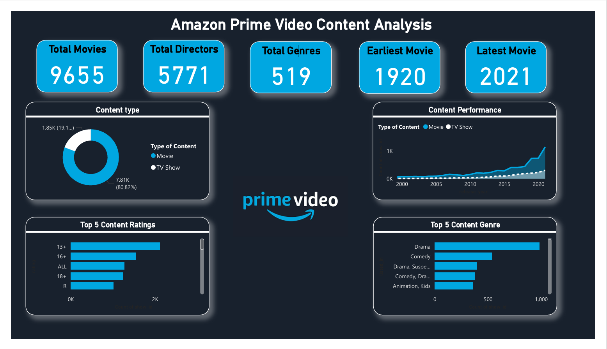

## 📊 Amazon Prime Video Content Analysis Dashboard

### 🔹 Overview
This project analyzes Amazon Prime Video content using Power BI to understand the distribution of movies and TV shows, popular genres, and content release trends over time.

---

### 🔹 Tools Used
- Power BI  
- Dataset (CSV)

---

### 🔹 Key Features
- Designed KPI cards to display total movies, directors, and genres  
- Created a donut chart to visualize content type distribution (Movies vs TV Shows)  
- Built bar charts to identify top genres and content ratings  
- Developed a line chart to analyze content trends over the years  

---

### 🔹 Key Insights
- Movies dominate the platform compared to TV shows  
- Drama and Comedy are among the most frequently occurring genres  
- There is a noticeable increase in content releases in recent years  

---

### 🔹 Dashboard Preview

---

### 🔹 Files Included
- Dataset (.csv)  
- Dashboard screenshot (.png)  
- Dashboard PDF  
